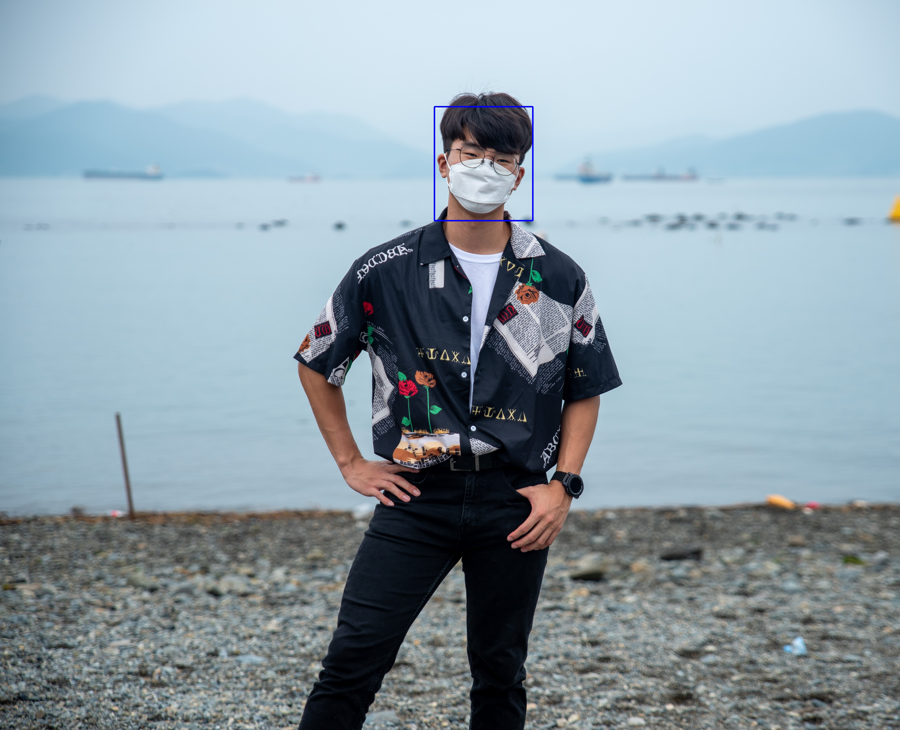

# Mask_Remover

#### Description: Guess the face without the mask.
---
#### dataset: http://mmlab.ie.cuhk.edu.hk/projects/CelebA.html
---
#### Face recognition using Google api
##### https://cloud.google.com/vision/docs/detecting-faces?hl=ko
 
---
#### Face inpainting
---
#### reference:
##### https://cloud.google.com/vision/docs/detecting-faces?hl=ko
##### https://arxiv.org/abs/1710.10196
##### https://github.com/tkarras/progressive_growing_of_gans
##### https://github.com/lyndonzheng/Pluralistic-Inpainting
---
